# 1. Sub Topic 1
## Assignment

To make the title scroll horizontally using  `<marquee>` tag, we can include our `<h1>` inside of the it.

```html
<!DOCTYPE html>
<html>
	<head>
		<title>Welcome to my Virtual Terrarium</title>
		<meta charset="utf-8" />
		<meta http-equiv="X-UA-Compatible" content="IE=edge" />
		<meta name="viewport" content="width=device-width, initial-scale=1" />
	</head>
	<body>
    <marquee behavior="scroll" direction="right">
  <h1>Scrolling Heading</h1>
    </marquee>
    <div id="page">
	<div id="left-container" class="container">
		<div class="plant-holder">
			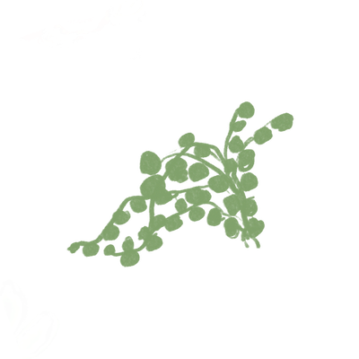
		</div>
		<div class="plant-holder">
			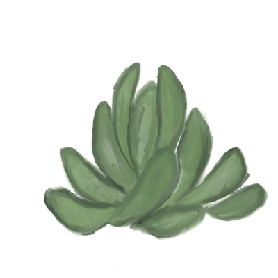
		</div>
		<div class="plant-holder">
			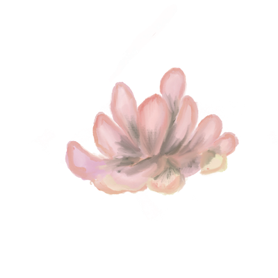
		</div>
		<div class="plant-holder">
			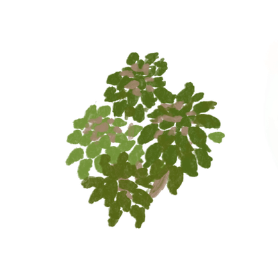
		</div>
		<div class="plant-holder">
			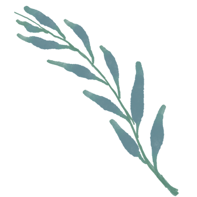
		</div>
		<div class="plant-holder">
			
		</div>
		<div class="plant-holder">
			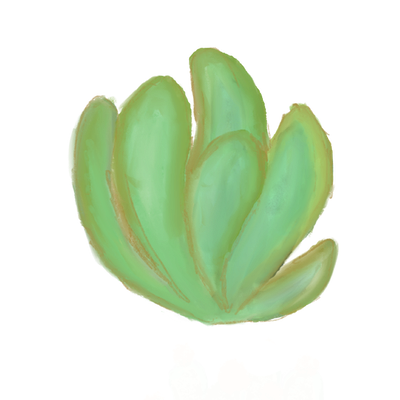
		</div>
	</div>
	<div id="right-container" class="container">
		<div class="plant-holder">
			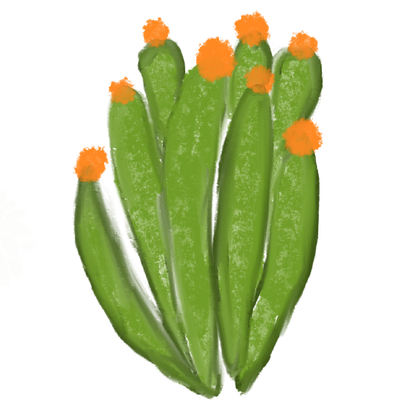
		</div>
		<div class="plant-holder">
			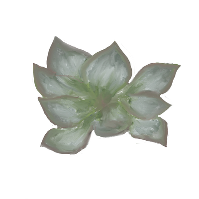
		</div>
		<div class="plant-holder">
			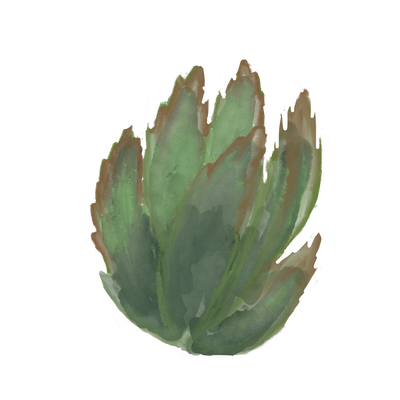
		</div>
		<div class="plant-holder">
			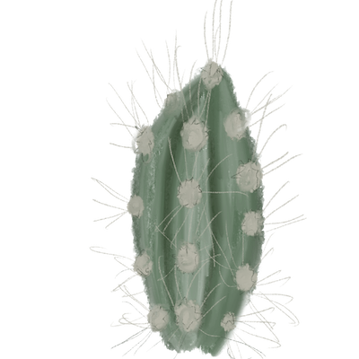
		</div>
		<div class="plant-holder">
			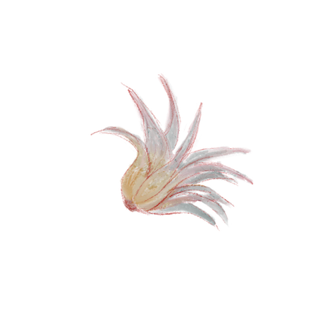
		</div>
		<div class="plant-holder">
			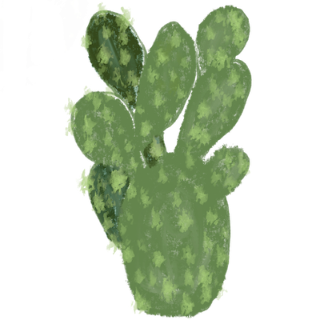
		</div>
		<div class="plant-holder">
			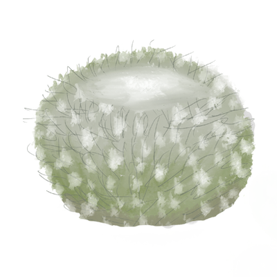
		</div>
	</div>
    <div id="terrarium">
	<div class="jar-top"></div>
	<div class="jar-walls">
		<div class="jar-glossy-long"></div>
		<div class="jar-glossy-short"></div>
	</div>
	<div class="dirt"></div>
	<div class="jar-bottom"></div>
</div>
</div></body>
</html>
```

## Challenge

### My personal website

```html
<!DOCTYPE html>
<html lang="en">
<head>
    <title>Resume</title>
</head>
<body>
    <h1 style="text-align: center">Anandajith.S</h1>
    <h2 style="text-align: center">B.Tech in Computer Science and Engineering</h2>
    <h3><bold><u>Contact information</u></bold></h3>
    <p>Email Address: <a href="mailto:anandajiths2006@gmail.com">anandajiths2006@gmail.com</a></p>
    <p>Phone: <a href="tel:+91 8714399795">8714399795</a></p>
    <p>Linkedin Profile: <a href="https://www.linkedin.com/in/anandajith-s?utm_source=share&utm_campaign=share_via&utm_content=profile&utm_medium=android_app">Anandajith.S</a></p>
    <h3><u>Education</u></h3>
    <h4>B.Tech</h4>
    <p>Branch: Computer Science and Engineering</p>
    <p>Institution: Amrita Vishwa Vidyaapetham, Amritapuri</p>
    <h3><u>Skills</u></h3>
    <h4>Languages known</h4>
    <ul>
        <li>Python</li>
        <li>Java</li>
        <li>HTML</li>
        <li>Javascript</li>
        <li>C++</li>
    </ul>
    <h3><u>Portflio</u></h3>
    <h4>Github profile:<a href="https://github.com/AnandajithS">anandajiths2006</a></h4>
</body>
</html>
```
# 2. Sub Topic 2
## Assignment

```css
.jar-glossy-long{
    position: absolute;
    background: #e0fffb;
    border-radius: 1rem 1rem 1rem 1rem;
	z-index:-1;
    bottom: 15%;
    left: 5%;
    height: 20%;
    width: 3.5%;
    opacity:0.9;

}
.jar-glossy-short{
	position: absolute;
    background: #e0fffb;
    border-radius: 1rem 1rem 1rem 1rem;
	z-index:-1;
    bottom: 40%;
    left: 5%;
    height: 5%;
    width: 3.5%;
    opacity:0.9;
}
```

## Challenge

For this challenge, I created a class called `.container`. I applied it to `#left-container` and `#right-container`.
I used  Flexbox for this

```html
            <div id="left-container" class="container">
                <div class="plant-holder">
                    
                </div>
                <div class="plant-holder">
                    
                </div>
                <div class="plant-holder">
                    
                </div>
                <div class="plant-holder">
                    
                </div>
                <div class="plant-holder">
                    
                </div>
                <div class="plant-holder">
                    
                </div>
                <div class="plant-holder">
                    
                </div>
            </div>
            <div id="right-container" class="container">
                <div class="plant-holder">
                    
                </div>
                <div class="plant-holder">
                    
                </div>
                <div class="plant-holder">
                    
                </div>
                <div class="plant-holder">
                    
                </div>
                <div class="plant-holder">
                    
                </div>
                <div class="plant-holder">
                    
                </div>
                <div class="plant-holder">
                    
                </div>
```

```css
#left-container {
	background-color: #eee;
	width: 200px;
	left: 0px;
	top: 0px;
	position: absolute;
	height: 940px;
	padding: 10px;
}

#right-container {
	background-color: #eee;
	width: 200px;
	right: 0px;
	top: 0px;
	position: absolute;
	height: 940px;
	padding: 10px;
}


.container{
	display: flex;
	flex-direction: column;
	justify-content: space-evenly;
	align-content: center;
}
```

I made sure to check if the elements are aligning properly in different browsers

**Chrome**


**Firefox**


# 3. Sub Topic 
## Assignment


**MutationObserver**
The `MutationObserver` interface provides the ability to watch for changes being made in
a webpage. We can define a callback function which will be executed when the element being
watched undergoes some specific changes. It is extremely useful as it reacts instantly to updates, hence it is used extensively in chat applications. An example of this when
a person sends a message to another person, the `MutationObserver` will detect it and
immediately trigger notifications.


## Challenge

I added an event listener which makes the plants go inside the container when they are
double clicked. The event listener sets a random position for the plant based on the
dimensions of the container to ensure that they dont clutter up at a single point.

```javascript

document.querySelectorAll(".plant").forEach((plant) => {
    plant.addEventListener("dblclick", () => {
        const interior = document.querySelector(".jar-walls");
        interior.appendChild(plant);
        plant.style.position = "absolute"; 
        plant.style.zIndex = "3";

        const jarRect = interior.getBoundingClientRect();

        const randomX = Math.random() * (jarRect.width - plant.width);
        const randomY = Math.random() * (jarRect.height - plant.height);
        
        
        plant.style.left = `${randomX}px`;
        plant.style.top = `${randomY}px`;
    });
});
```
