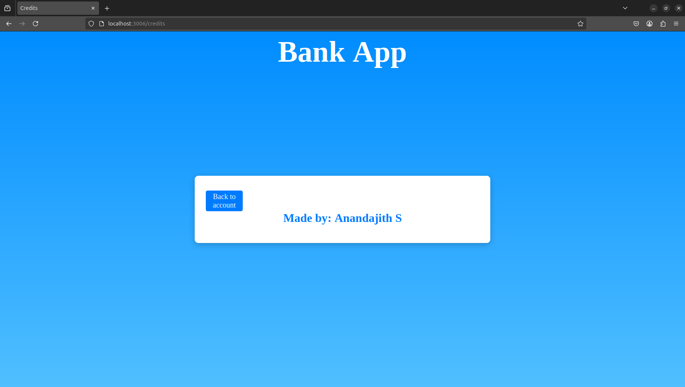
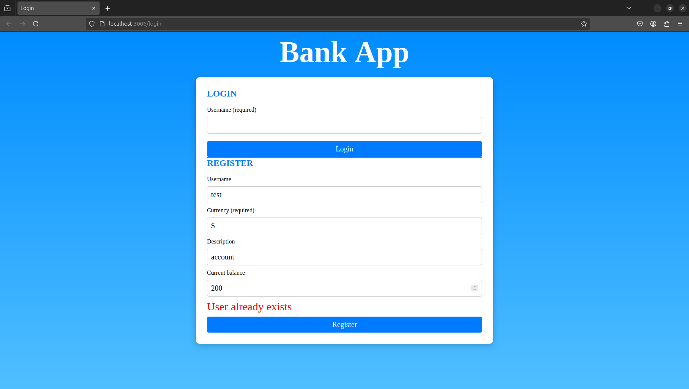

# 1. Subtask-1

## Challenge
We can do this by adding `/credits':{templateId: 'credits'}` in our `routes`



## Assignment
For this assignment, we need to modify `route` and the function `updateRoute()`. We add 
`document.title = route.title;` in `updateRoute()` to update our window title.

```javascript
const routes = {
  '/login': { templateId: 'login', title:"Login"},
  '/dashboard': { templateId: 'dashboard', title:"Dashboard",init: refresh, onShow:()=>console.log("Dashboard is shown") },
  '/credits':{templateId: 'credits',title:"Credits"}
};
function updateRoute() {
  const path = window.location.pathname;
  const route = routes[path];
    if (!route) {
    return navigate('/login');
  }
  document.title = route.title;
  const template = document.getElementById(route.templateId);
  const view = template.content.cloneNode(true);
  const app = document.getElementById('app');
  app.innerHTML = '';
  app.appendChild(view);

  if (typeof route.init === 'function') {
    route.init();
  }
}
```

# 2.Subtask-2

## Challenge
The following code in `register()` will display the error message:

```javascript
  if (result.error) {
    return updateElement('registerError', result.error);
  }
```


## Assignment
Created a css file named `styles.css` and linked it to `index.html`

# 3.Subtask-3

## Challenge
Styled the dashboard page and used media queries to create a responsive design

## Assignments
- Extracted the server base API URL 

- Reorganized the code and added comments at relevant locations

- Created a new function `sendRequest` to send a HTTP request to the URL instead of using the same code repeatedly 

# 4.Subtask-4

## Challenge
Everytime the dashboard is loaded, the account data is reloaded. Hence, we don't need to store all the account details since they can be fetched from the server. First, I modified `updateState()` to only save the current user. In the `init()` fuction, we called the `updateAccountData()`


